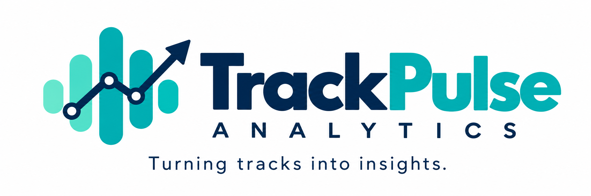
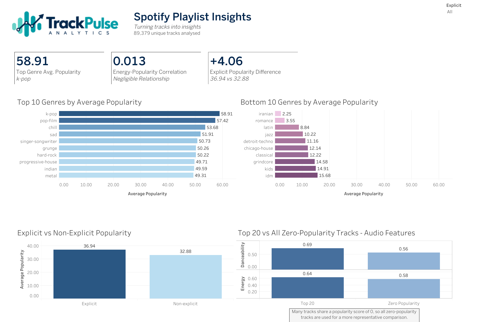

<p align="center">
  
</p>

# Spotify Music Trend Analysis

## Project Overview

Spotify Music Trend Analysis was created as part of the Code Institute Data Analytics with AI Hackathon: Dashboard Essentials.

We worked as a team of three to analyse Spotify track data and explore patterns in music popularity.

For the project, we created a fictional music analytics company called **TrackPulse Analytics**.

**TrackPulse Analytics:** *Turning tracks into insights.*

The project combines:

- Python for ETL, data cleaning and analysis.
- Exploratory data analysis.
- Hypothesis-led analysis and statistical testing.
- Tableau Public for the final interactive dashboard.
- Git and GitHub for collaboration and version control.
- GitHub Projects for project planning and progress tracking.
- Generative AI as a support tool during development.

The final dashboard is called **Spotify Playlist Insights**.

> TrackPulse Analytics is a fictional music analytics company created for this hackathon and is not affiliated with Spotify.

---

## Business Requirements

The main aim of the project was to investigate patterns in Spotify track popularity and turn the results into clear insights for a non-technical user.

We focused on four main research questions:

1. Which genres have the highest and lowest average popularity?
2. How are danceability, energy and duration associated with popularity?
3. What differences can be identified between highly popular and low-popularity tracks?
4. Are explicit tracks more or less popular than non-explicit tracks?

The final dashboard was designed to make these findings easy to explore without needing to read the Python notebooks.

---

## Dataset

The project uses the **Spotify Tracks Dataset** available through Kaggle.

[Spotify Tracks Dataset - Kaggle](https://www.kaggle.com/datasets/maharshipandya/-spotify-tracks-dataset)

The original dataset contained:

- **114,000 rows**
- **22 columns**
- **114 music genres**

The dataset contains track-level information including:

- Artist
- Album
- Track name
- Popularity
- Explicit status
- Danceability
- Energy
- Duration
- Loudness
- Speechiness
- Acousticness
- Instrumentalness
- Liveness
- Valence
- Tempo
- Time signature
- Genre

One record had missing values for artist, album name and track name.

After the initial ETL process, the cleaned visualisation dataset contained **113,999 records**.

---

## ETL Process

The ETL process was completed using Python.

### Extract

The original Spotify CSV file was loaded into a pandas DataFrame.

The structure of the dataset was reviewed, including:

- Shape
- Column names
- Data types
- Missing values
- Unique values
- Numerical ranges
- Categorical values
- Duplicate values

### Transform

The ETL process included:

- Checking and cleaning text fields.
- Checking numerical values.
- Checking categorical fields.
- Investigating missing data.
- Removing the single row with missing artist, album and track information.
- Removing unnecessary columns such as `track_id` and an additional index column.
- Checking data quality and consistency.

The cleaned visualisation dataset contained **113,999 records**.

### Dashboard Data Preparation

An additional preparation stage was completed before the data was loaded into Tableau.

Repeated tracks were identified using:

- Artist
- Album name
- Track name

The data was first sorted by popularity in descending order.

Where the same artist, album and track combination appeared more than once, the record with the **highest popularity value** was retained.

The remaining unnecessary index columns were also removed.

This reduced the data from:

**113,999 records → 89,379 unique track records**

A total of **24,620 repeated track records** were removed during this stage.

The final Tableau dataset contained:

- **89,379 rows**
- **19 columns**
- **0 missing values**
- **0 duplicate artist + album + track combinations**

The final file was exported as:

`spotify_dashboard_data.csv`

---

## Analysis and Hypotheses

The analysis was split into several hypothesis-led investigations based on the main business questions.

### Genre Popularity

The team investigated which genres had the highest and lowest average popularity.

### Audio Features and Popularity

Danceability, energy and track duration were explored to see how they were associated with track popularity.

### Top 20 and Bottom 20 Tracks

The characteristics of the most and least popular tracks were compared.

Features explored included:

- Energy
- Danceability
- Duration
- Loudness
- Tempo
- Genre
- Explicit lyrics

### Explicit and Non-Explicit Tracks

Average popularity was compared between explicit and non-explicit tracks.

### Additional Spotify Audio Features

Further Spotify features were also explored, including:

- Speechiness
- Instrumentalness
- Time signature
- Genre within highly popular tracks
- Valence
- Liveness
- Acousticness

These were treated as additional exploratory findings rather than the main conclusions of the final dashboard.

---

## Formal Statistical Hypothesis - Energy and Popularity

The main formal statistical hypothesis focused on whether track energy was associated with popularity.

### Null Hypothesis - H0

There is no significant relationship between track energy and popularity.

### Alternative Hypothesis - H1

There is a significant relationship between track energy and popularity.

### Validation

The distributions of energy and popularity were reviewed before correlation analysis was carried out.

The main results were:

- **Pearson correlation: approximately 0.013**
- **Pearson p-value: approximately 0.0001**
- **Spearman correlation: approximately -0.017**

At a significance level of 0.05, the Pearson p-value is below 0.05, so the null hypothesis is rejected statistically.

However, the Pearson correlation of approximately **0.013** shows that the actual relationship is extremely small.

This means that although the relationship is statistically detectable due to the large dataset, it is **negligible in practical terms**.

The main business conclusion is therefore:

> **Energy alone provides very little useful information about whether a track will be popular.**

The dashboard also showed that subgroup results could be different.

For example, when the dashboard is filtered to explicit tracks only, the energy-popularity correlation changes to approximately **-0.164**, showing a weak negative relationship within that subgroup.

These findings describe associations only and do not show that energy causes popularity.

---

## Key Findings

### Genre Popularity

**K-pop** had the highest average popularity in the final dashboard dataset:

**58.91**

Other highly ranked genres included:

- Pop-film
- Chill
- Sad
- Singer-songwriter
- Grunge
- Hard-rock

The lowest average popularity genres included Iranian and Romance.

These results describe the tracks represented in this dataset and should not be interpreted as a judgement of the quality of any music genre.

### Explicit vs Non-Explicit Tracks

Average popularity was:

- **Explicit tracks: 36.94**
- **Non-explicit tracks: 32.88**

Explicit tracks therefore had an average popularity score approximately:

**4.06 points higher**

This is a descriptive finding and does not mean that explicit content causes higher popularity.

### Energy and Popularity

The overall energy-popularity correlation was approximately:

**0.013**

This represents a negligible overall relationship.

The interactive dashboard also showed that this relationship could change when looking at different subgroups.

### Top 20 vs Zero-Popularity Tracks

The Top 20 tracks had:

- Average danceability: **0.69**
- Average energy: **0.64**

Tracks with a popularity score of zero had:

- Average danceability: **0.56**
- Average energy: **0.58**

The Top 20 tracks were therefore more danceable and slightly more energetic on average than the zero-popularity group.

This does not mean these features cause a track to become popular.

---

## Top 20 and Bottom 20 Limitation

One of the original research questions compared the Top 20 and Bottom 20 tracks.

During the analysis, we found that a large number of tracks shared the minimum popularity score of **0**.

This created an important limitation.

Selecting only 20 tracks from a much larger group of tracks tied at zero could produce different results depending on which 20 records were selected.

We therefore kept the original Top 20 and Bottom 20 investigation but added a more representative comparison for the final dashboard:

**Top 20 Tracks vs All Zero-Popularity Tracks**

This allowed us to compare the Top 20 with the complete lowest-popularity group rather than relying on an arbitrary selection of 20 tied records.

---

## Dashboard

The final Tableau dashboard is called:

**Spotify Playlist Insights**

It was designed under the fictional **TrackPulse Analytics** brand.

The dashboard contains:

- Top Genre Average Popularity KPI.
- Energy-Popularity Correlation KPI.
- Explicit Popularity Difference KPI.
- Top 10 Genres by Average Popularity.
- Bottom 10 Genres by Average Popularity.
- Explicit vs Non-Explicit Popularity.
- Top 20 vs All Zero-Popularity Tracks audio feature comparison.
- Interactive Explicit filter.

### Dashboard Interactivity

Users can switch between:

- All tracks
- Explicit tracks
- Non-explicit tracks

Relevant KPIs and charts recalculate when the filter changes.

For example, the Energy-Popularity Correlation KPI changes dynamically and also changes its description depending on the strength and direction of the correlation.

Context filters were used where necessary so that Tableau recalculated Top N results using the selected subgroup rather than calculating the overall Top N first.

The Explicit Popularity Difference KPI and Explicit vs Non-Explicit comparison remain independent of this filter because both groups are required to calculate those comparisons.

### How to Use the Dashboard

1. Open the Tableau Public dashboard.
2. Use the **Explicit** filter to select All, Explicit or Non-explicit tracks.
3. The relevant KPIs and charts update automatically.
4. Hover over visualisations to view additional information.

### Dashboard Design

The dashboard was designed with a simple visual hierarchy:

1. Branding and dashboard title.
2. Three headline KPIs.
3. Highest and lowest popularity genres.
4. Explicit vs non-explicit comparison.
5. Top 20 vs zero-popularity audio feature comparison.

The TrackPulse Analytics navy and teal branding was used to keep the dashboard visually consistent.

Labels and notes were added where additional explanation was needed.

The note underneath the Top 20 comparison explains why all zero-popularity tracks were used rather than an arbitrary Bottom 20 sample.

### Tableau Public

[View Spotify Playlist Insights on Tableau Public](https://public.tableau.com/views/SpotifyPlaylistInsightsTrackPulseAnalytics/SpotifyPlaylistInsights?:language=en-GB&:sid=&:redirect=auth&:display_count=n&:origin=viz_share_link)

### Dashboard Screenshot



---

## Mapping Business Requirements to the Dashboard

| Business Requirement | Dashboard Solution |
| --- | --- |
| Identify the highest and lowest popularity genres | Top 10 and Bottom 10 Genre charts |
| Investigate audio features and popularity | Energy KPI and Top 20 vs Zero-Popularity audio feature comparison |
| Compare highly popular and low-popularity tracks | Top 20 vs All Zero-Popularity Tracks |
| Compare explicit and non-explicit tracks | Explicit vs Non-Explicit chart and KPI |
| Allow users to explore different groups | Interactive Explicit filter |
| Communicate findings to non-technical users | KPIs, charts, labels, tooltips and notes |

---

## Analysis Techniques Used

The project used a mixture of descriptive, exploratory and statistical analysis.

Techniques included:

- Data cleaning
- Missing-value analysis
- Duplicate investigation
- Data validation
- Grouping and aggregation
- Mean comparisons
- Ranking
- Exploratory data analysis
- Distribution checks
- Correlation analysis
- Pearson correlation
- Spearman correlation
- Group comparisons
- Interactive Tableau analysis

Python visualisations were created using libraries including Matplotlib, Seaborn and Plotly.

---

## Project Management

GitHub Projects was used to manage the project throughout the hackathon.

The work was broken into GitHub Issues with supporting tasks.

Issues were assigned to team members and linked to project milestones.

The project board used the workflow:

**Todo → In Progress → Review → Done**

Regular team check-ins were used to:

- Review progress.
- Discuss completed work.
- Discuss what each person was working on.
- Identify blockers.
- Decide what needed to be prioritised next.
- Update the project board.
- Review deadlines.
- Discuss changes to the project scope.

Because the project lasted only four days, the project plan was adjusted when necessary as work developed.

---

## Scope and Prioritisation

Because the hackathon lasted four days, the team prioritised the minimum viable product before optional work.

### Must Have

- Clean and validated Spotify dataset.
- Genre popularity analysis.
- Audio feature analysis.
- Top and Bottom track analysis.
- Explicit vs non-explicit analysis.
- Statistical hypothesis testing.
- Interactive Tableau dashboard.
- Testing and validation.
- README documentation.
- Final presentation.

### Should Have

- Useful Tableau filters and controls.

This was completed through the interactive Explicit filter and dynamic KPI behaviour.

### Could Have

- Additional Spotify audio feature analysis.
- Simple popularity prediction model.

The additional audio feature analysis was completed.

The prediction model was not completed because the team prioritised the core ETL, analysis, dashboard, testing and documentation within the available timeframe.

### Won't Have

- Spotify recommendation system.

A recommendation system was kept outside the project scope so that the team could focus on completing the core project successfully within four days.

---

## Team Roles

We worked as a team of three.

Each member had a main role, but the roles were flexible and we supported each other where needed.

### Sahra Osman - Project Manager

Sahra was mainly responsible for:

- Setting up and managing the GitHub Project board.
- Creating issues, supporting tasks and milestones.
- Assigning work and tracking progress.
- Running team check-ins.
- Monitoring deadlines and project scope.
- Supporting the team with Git and GitHub where required.
- Preparing the final dashboard-ready dataset.
- Building the final Tableau dashboard.
- Testing the dashboard and its filters.
- Coordinating the README.
- Coordinating the final presentation.

### Roger Williams - Data Architect

Roger was mainly responsible for:

- Extracting the original Spotify dataset.
- Developing the ETL process.
- Cleaning and transforming the data.
- Checking data quality and consistency.
- Developing the main analysis notebooks.
- Carrying out the hypothesis-led exploratory analysis.
- Analysing genre popularity.
- Analysing danceability, energy and duration.
- Analysing explicit and non-explicit tracks.
- Analysing the Top 20 and Bottom 20 tracks.
- Exploring additional Spotify audio features.
- Carrying out the statistical testing for energy and popularity.
- Producing the main analytical findings used by the team.
- Working with the Data Analyst to review and interpret the analysis.

### Adam Bauker - Data Analyst

Adam was mainly responsible for:

- Carrying out additional exploratory analysis using the final dashboard dataset.
- Supporting the exploratory analysis.
- Reviewing results produced from the analysis notebooks.
- Helping interpret findings from the Spotify data.
- Discussing patterns and observations found during the analysis.
- Working with Roger on the analytical findings.
- Helping decide which findings were most useful to communicate.
- Contributing to team discussions and check-ins.
- Supporting preparation for the final presentation.

Although each team member had a main area of responsibility, decisions about the final project were discussed as a team.

---

## Project Milestones

### Milestone 1 - Day 1

The first milestone focused on:

- Agreeing the project idea.
- Defining the business questions.
- Assigning team roles.
- Setting up the GitHub repository.
- Setting up the GitHub Project board.
- Creating issues and supporting tasks.
- Creating milestones.
- Beginning the ETL process.
- Starting the initial analysis.

### Milestone 2 - Day 2

The second milestone focused on:

- Main exploratory analysis.
- Research questions.
- Hypothesis-led analysis.
- Statistical testing.
- Visualisations.
- Initial Tableau development.
- Progress reviews and team check-ins.

### Milestone 3 - Day 3

The third milestone focused on:

- Dashboard development.
- ETL and analysis validation.
- Dashboard testing.
- Documentation.
- Dashboard refinements.
- Reviewing the project against the business requirements.

### Milestone 4 - Day 4

The final milestone focused on:

- Final quality checks.
- Completing the README.
- Presentation preparation.
- Presentation dry run.
- Reviewing deliverables.
- Final submission and presentation.

---

## Testing and Validation

Testing was carried out throughout the project rather than only at the end.

### ETL Validation

The team checked:

- Missing values
- Dataset dimensions
- Data types
- Numerical values
- Categorical values
- Duplicate values
- Removed columns
- Final exported data
- Data consistency

The original dataset contained one row with missing artist, album and track values.

This row was removed during ETL.

### Dashboard Dataset Validation

The final Tableau preparation notebook confirmed:

- **89,379 unique track records**
- **19 columns**
- **0 missing values**
- **0 duplicate artist + album + track combinations**

The dashboard preparation notebook also checked important results before export.

For example:

- K-pop average popularity: approximately **58.91**
- Explicit average popularity: approximately **36.94**
- Non-explicit average popularity: approximately **32.88**

### Analysis Validation

Results from the Python analysis were compared with the Tableau calculations before the dashboard was finalised.

This helped confirm that the final dashboard was using the same track-level methodology as the final analysis.

### Dashboard Testing

The Tableau dashboard was tested for:

- Filter functionality
- Dynamic KPIs
- Correlation recalculation
- KPI wording
- Tooltips
- Titles
- Labels
- Chart readability
- Context filters
- Explicit filtering
- Non-explicit filtering
- All-track view
- Tableau Public functionality

The published Tableau Public dashboard was also tested after deployment.

---

## Challenges and Problem Solving

### Importing Custom Python Modules

The project contains reusable Python files inside the `assets/python_files` folder.

Because the Jupyter notebooks were stored in a different folder, importing these modules directly did not initially work.

Generative AI was used to help identify a solution using `sys.path` and `pathlib`, allowing the folder containing the custom modules to be added to the Python path.

This solution was then reused across the analysis notebooks.

### Missing Data

One row contained missing values for:

- Artist
- Album name
- Track name

Because this affected only one record and the identifying track information was missing, the row was removed.

### Repeated Track Records

The visualisation dataset contained repeated artist, album and track combinations.

For the final dashboard dataset, records were sorted by popularity before duplicate artist + album + track combinations were removed.

Where repeated records existed, the record with the highest popularity was retained.

This created a consistent track-level dataset for Tableau.

### Bottom 20 Popularity Ties

A large number of tracks shared a popularity score of zero.

This meant that selecting only 20 of those tracks could produce an unrepresentative sample.

The final dashboard therefore compares the Top 20 tracks with **all zero-popularity tracks** for the audio-feature comparison.

### Tableau Filter Order

Top N calculations did not always behave as expected when the Explicit filter was applied.

Context filters were used where required so that the selected Explicit group was filtered before the Top N calculation was performed.

### Plotly Sunburst Error

While developing a Bottom 20 sunburst visualisation, a `ZeroDivisionError` was encountered.

Generative AI was used to help troubleshoot the issue.

A simple count field was added and used as the value in the Plotly sunburst chart, which resolved the error.

### Project Scope

The four-day timeframe meant that the team had to prioritise.

The prediction model and recommendation system were not developed because completing the core ETL, analysis, interactive dashboard, testing and documentation was considered more important.

---

## Use of Generative AI

Generative AI was used as a support tool throughout the project.

ChatGPT and GitHub Copilot were used for areas including:

- Project planning and organising tasks.
- Brainstorming the business questions and project structure.
- Supporting Python debugging and troubleshooting.
- Helping resolve issues with importing custom Python modules.
- Troubleshooting visualisation errors.
- Supporting Tableau dashboard design and filter logic.
- Reviewing analysis and interpretation.
- Structuring and reviewing the README.
- Supporting preparation for the final presentation.
- Creating the fictional TrackPulse Analytics logo and branding.

Roger also used GitHub Copilot for code completion and repetitive coding tasks within VS Code.

AI suggestions were reviewed before being used. Code, calculations and analytical findings were checked against the dataset rather than being accepted automatically.

More detailed examples of how Generative AI was used are documented in:

`documents/What_AI_Used_For.md`

---

## Ethical, Privacy and Governance Considerations

The project uses a public track-level Spotify dataset and does not contain personal information about individual Spotify users.

### Privacy

The dataset contains information about tracks rather than personal user behaviour.

No names, contact details, Spotify account information or private listening histories were processed.

### Ethical Interpretation

Popularity was not treated as a measure of musical quality or artistic value.

The team also avoided treating associations as evidence of causation.

For example:

- Higher popularity among explicit tracks does not mean explicit lyrics cause popularity.
- Higher danceability among the Top 20 does not prove danceability causes popularity.
- Energy-popularity relationships only describe associations within the dataset.

### Representation and Bias

Genres and artists may not be equally represented in the dataset.

This can affect comparisons between groups.

Popularity can also be influenced by factors not included in the dataset, including marketing, artist recognition, release timing and playlist exposure.

### Governance and Attribution

The dataset source is credited in this README.

GitHub was used to maintain a record of project changes.

TrackPulse Analytics is clearly identified as fictional so that the project does not imply a commercial relationship with Spotify.

---

## Version Control and Collaboration

Git and GitHub were used throughout the project to manage changes and allow the team to work on the same repository.

The team used:

- Commits to record project progress.
- Feature branches for some areas of development.
- Merging completed work into the `main` branch.
- GitHub Issues to track tasks.
- GitHub Projects to manage progress.
- Milestones to organise the four-day project.

The Git workflow was not identical throughout the whole hackathon.

Some work was completed on separate branches and merged into `main`, while some changes were merged more directly.

Pull requests were used for some parts of the project, but they were **not used consistently for every change**.

GitHub still provided a record of the project's development through commits, branches, issues and merges.

---

## Reproducing the Project

To reproduce the project:

1. Clone the GitHub repository:

```bash
git clone https://github.com/sahra02/Spotify-Music-Trend-Analysis.git
```

2. Open the project folder.

3. Install the required Python libraries:

```bash
pip install -r requirements.txt
```

4. Run the ETL notebook.

5. Run the analysis notebooks.

6. Run:

`Dashboard_Data_Preparation.ipynb`

7. This produces the final dashboard dataset:

`spotify_dashboard_data.csv`

8. Open the Tableau workbook and connect or refresh it using the final dashboard dataset.

The same process can be followed if the dataset is updated in the future.

---

## Project Files

The repository is organised into the following main areas:

- `assets/` - datasets, images and supporting Python files.
- `jupyter_notebooks/` - ETL, exploratory analysis, statistical testing and dashboard preparation notebooks.
- `tableau/` - Tableau dashboard files.
- `documents/` - supporting documentation, including detailed Generative AI usage.
- `requirements.txt` - Python dependencies required to run the project.
- `README.md` - main project documentation.

---

## Main Tools and Libraries

The main tools and libraries used were:

- Python
- pandas
- NumPy
- Matplotlib
- Seaborn
- Plotly
- SciPy
- Jupyter Notebook
- Tableau Public
- Git
- GitHub
- GitHub Projects
- GitHub Copilot
- ChatGPT

---

## Known Limitations and Unfixed Issues

There were no known major dashboard bugs at the time of submission.

The main analytical limitations were:

- Many tracks share the same popularity score.
- A large number of tracks have a popularity score of zero.
- Genre and artist representation may not be equal.
- Spotify popularity can be influenced by factors not included in the dataset.
- Spotify popularity should not be treated as the same thing as streams, sales or musical quality.
- Findings from a small group such as the Top 20 should not automatically be generalised to all tracks.

The Bottom 20 tie issue was reduced in the final dashboard by comparing the Top 20 tracks against all zero-popularity tracks.

---

## Future Development and Maintenance

If the project was developed further, possible improvements could include:

- More detailed subgroup analysis.
- Additional dashboard filters.
- A properly designed and evaluated popularity prediction model.
- Time-based analysis using a suitable historical dataset.
- Comparison with additional music datasets.

The dashboard can be updated by rerunning the ETL and dashboard preparation process before refreshing the Tableau data source.

Future changes should continue to be tested before the updated dashboard is published.

---

## Reflection

The project showed the importance of checking the data behind a visualisation rather than simply accepting the first result.

The Bottom 20 analysis was a good example. At first it appeared straightforward, but the large number of tracks tied at a popularity score of zero meant that selecting only 20 tracks could produce an unrepresentative comparison.

The project also highlighted the importance of:

- Keeping Python and Tableau calculations consistent.
- Testing interactive filters carefully.
- Looking at effect size as well as statistical significance.
- Reviewing Generative AI suggestions rather than automatically accepting them.
- Using Git and GitHub when several people are contributing to the same project.
- Managing project scope within a short deadline.

---

## Deployment

The final interactive dashboard was deployed using **Tableau Public**.

### Tableau Dashboard

[Spotify Playlist Insights](https://public.tableau.com/views/SpotifyPlaylistInsightsTrackPulseAnalytics/SpotifyPlaylistInsights?:language=en-GB&:sid=&:redirect=auth&:display_count=n&:origin=viz_share_link)

### GitHub Repository

[Spotify Music Trend Analysis](https://github.com/sahra02/Spotify-Music-Trend-Analysis)

---

## Credits

### Data

Spotify Tracks Dataset:

[Spotify Tracks Dataset - Kaggle](https://www.kaggle.com/datasets/maharshipandya/-spotify-tracks-dataset)

### Project Guidance

This project was created as part of the **Code Institute Data Analytics with AI Hackathon: Dashboard Essentials**.

The Code Institute hackathon brief and guidance were used to structure the project, milestones and final deliverables.

### Generative AI

ChatGPT, GitHub Copilot and Generative AI image tools were used as support tools during development.

More detailed AI usage is documented in:

`documents/What_AI_Used_For.md`

---

## Acknowledgements

We would like to thank Code Institute and our bootcamp facilitators for providing the hackathon brief, guidance and support throughout the project.

We would also like to thank each member of the team for contributing to the project and helping us complete the work within the four-day hackathon.